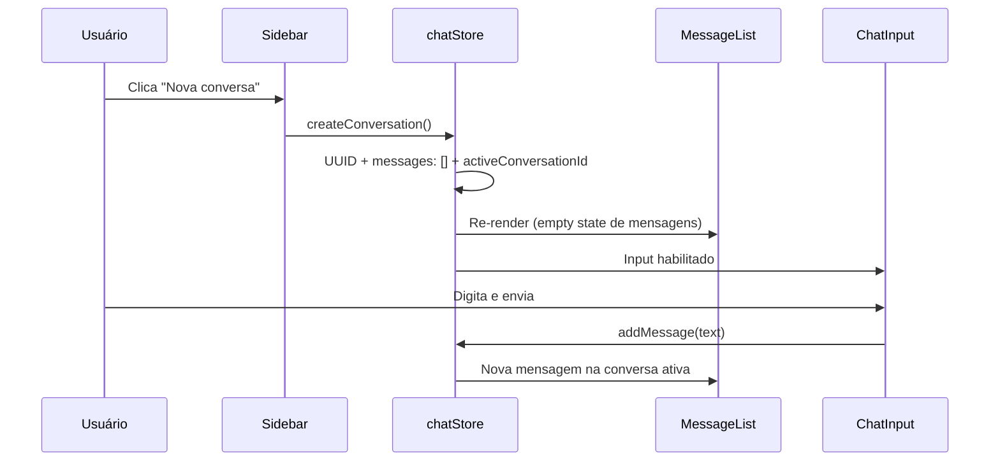
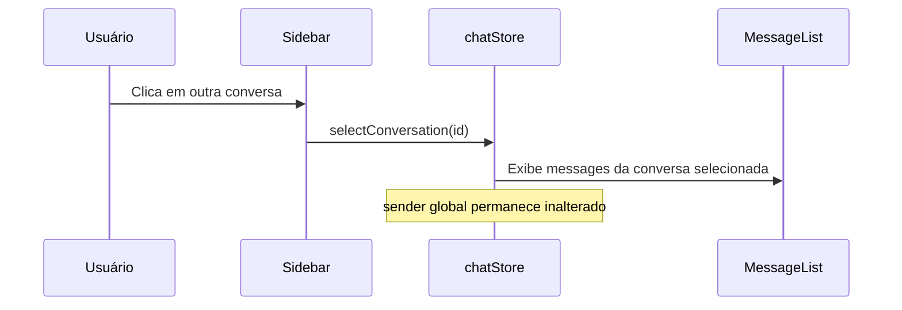

# PRD — Multi-chat

## 1. Visão geral

Evolução do chat de conversa única para **múltiplas conversas** independentes. O usuário gerencia conversas por um sidebar à esquerda, alterna entre elas e envia mensagens com o mesmo fluxo de remetente usuário/robô já existente.

O estado global passa de `useState` local para uma **store Zustand** em `src/stores/`. Tudo continua **apenas em memória** — ao recarregar a página, conversas e mensagens são perdidas.

**Stack existente:** Vite + React + TypeScript + Tailwind CSS.  
**Nova dependência:** [Zustand](https://zustand.docs.pmnd.rs/).

**Documento base:** [brain-drump.md](./brain-drump.md)  
**PRD anterior (chat único):** [../../prd.md](../../prd.md)

---

## 2. Objetivos

| Objetivo                              | Critério de sucesso                                                                          |
| ------------------------------------- | -------------------------------------------------------------------------------------------- |
| Múltiplas conversas isoladas          | Cada conversa mantém seu próprio histórico de `Message`                                      |
| Navegação entre conversas             | Sidebar lista conversas; clique ativa a conversa selecionada                                 |
| Criar conversa                        | Botão no sidebar cria conversa com UUID, seleciona automaticamente                           |
| Excluir conversa                      | Ícone de exclusão em cada item; ao excluir a ativa, volta ao empty state                     |
| Estado inicial sem conversa ativa     | Ao abrir o site, nenhuma conversa está selecionada                                           |
| Input condicional                     | Input desabilitado (opacidade 50%, ações bloqueadas) sem conversa ativa                      |
| Sidebar responsivo                    | Fixo à esquerda no desktop; retrátil no mobile via botão hamburger                           |
| Preservar comportamento do chat único | Envio, toggle, bolhas, auto-scroll e atalhos de teclado inalterados quando há conversa ativa |

---

## 3. Fora de escopo

- Persistência (localStorage, backend, etc.)
- Autenticação
- Edição ou exclusão de mensagens individuais
- Renomear conversas (identificação é o próprio ID)
- Horários, rótulos de remetente ou cabeçalho do chat
- Markdown, anexos ou formatação rica
- Busca ou filtros de conversas
- Confirmação modal antes de excluir conversa

---

## 4. Convenções técnicas

| Regra         | Detalhe                                  |
| ------------- | ---------------------------------------- |
| Tipos         | `type` (não `interface`) em `src/types/` |
| Componentes   | `src/components/`                        |
| Estado global | Zustand em `src/stores/`                 |
| Estilização   | Tailwind CSS exclusivamente              |
| Lint          | `oxlint`                                 |

---

## 5. Modelo de dados

### Tipos existentes (inalterados)

```ts
// src/types/message.ts
type Sender = 'user' | 'robot'

type Message = {
  id: string
  text: string
  sender: Sender
}
```

### Novo tipo

```ts
// src/types/conversation.ts
type Conversation = {
  id: string
  messages: Message[]
}
```

- `id`: UUID gerado na criação (`crypto.randomUUID()`)
- `messages`: histórico ordenado cronologicamente da conversa

### Store Zustand

```ts
// src/stores/chatStore.ts (estrutura conceitual)
type ChatState = {
  conversations: Conversation[]       // ordenadas da mais antiga à mais recente
  activeConversationId: string | null
  sender: Sender                      // global — compartilhado entre todas as conversas
}
```

### Ações da store

| Ação                     | Comportamento                                                                    |
| ------------------------ | -------------------------------------------------------------------------------- |
| `createConversation()`   | Gera UUID, adiciona conversa vazia ao final do array, define como ativa          |
| `selectConversation(id)` | Define `activeConversationId`                                                    |
| `deleteConversation(id)` | Remove a conversa do array; se era a ativa, define `activeConversationId = null` |
| `addMessage(text)`       | Adiciona `Message` à conversa ativa (valida trim e conversa ativa)               |
| `toggleSender()`         | Alterna `sender` entre `'user'` e `'robot'`                                      |

---

## 6. Requisitos funcionais

### RF-01 — Estado inicial

- Ao abrir o site: `activeConversationId === null`.
- Nenhuma conversa pré-criada.
- Input desabilitado.
- Área principal exibe empty state: *"Crie ou selecione uma conversa"* (ou texto equivalente).

### RF-02 — Sidebar de conversas

- Posicionado à **esquerda** da tela.
- Lista todas as conversas existentes, **da mais antiga à mais recente** (ordem de criação).
- Cada item exibe o **ID da conversa** como identificação.
- Item da conversa **ativa** tem destaque visual (ex.: fundo ou borda diferente).
- Clique em um item **seleciona** essa conversa como ativa.
- Botão **"Nova conversa"** (ou ícone + label equivalente) no sidebar cria e ativa uma nova conversa.

### RF-03 — Criar conversa

- Gera `id` via `crypto.randomUUID()`.
- Conversa inicia com `messages: []`.
- Adicionada ao **final** da lista (mais recente embaixo).
- **Selecionada automaticamente** como conversa ativa.
- Input habilitado após criação.

### RF-04 — Excluir conversa

- Cada item do sidebar possui **ícone/botão de excluir**.
- Clique no ícone remove a conversa da store.
- Se a conversa excluída era a **ativa**: `activeConversationId` volta para `null` (empty state global), **mesmo que existam outras conversas na lista**.
- Exclusão não exige confirmação.

### RF-05 — Histórico por conversa

- Ao alternar de conversa, a área de mensagens exibe apenas o histórico da conversa ativa.
- Comportamento de lista, bolhas, alinhamento e auto-scroll **idêntico ao PRD do chat único** (RF-01 a RF-02 do documento anterior).
- Conversa ativa sem mensagens: empty state *"Nenhuma mensagem ainda. Envie a primeira!"*.

### RF-06 — Input condicional

- **Sem conversa ativa** (`activeConversationId === null`):
  - Card de input com **opacidade 50%**.
  - Textarea, botão enviar e toggle de remetente **desabilitados** (não respondem a cliques/teclado).
- **Com conversa ativa**: input funciona normalmente (mesmas regras do chat único).

### RF-07 — Toggle usuário / robô (global)

- `sender` vive na store Zustand, **não** por conversa.
- Alternar o toggle afeta a próxima mensagem em **qualquer** conversa ativa.
- Ao trocar de conversa, o remetente ativo **permanece o mesmo**.
- Estado padrão ao abrir: `'user'`.
- Borda roxa no card quando `sender === 'robot'`.

### RF-08 — Envio de mensagem

- Só é possível enviar com conversa ativa.
- Validação, criação de `Message`, limpeza do textarea e atalhos de teclado inalterados.
- Mensagem é adicionada ao array `messages` da conversa ativa.

### RF-09 — Sidebar mobile (retrátil)

- Em viewports mobile: sidebar **oculto por padrão**.
- Botão **hamburger** no canto **superior esquerdo** abre o sidebar.
- Sidebar abre como **overlay** (drawer) sobre o conteúdo ou empurra o conteúdo — preferência: overlay com backdrop semi-transparente.
- Ao **selecionar** uma conversa ou **criar** nova no mobile, o sidebar **fecha automaticamente**.
- Segundo clique no hamburger (ou no backdrop) fecha o sidebar.

---

## 7. Requisitos visuais

### Layout desktop

```
┌──────────┬──────────────────────────────────────────────┐
│          │         fundo marrom claro (tela inteira)     │
│ Sidebar  │                                              │
│ fixo     │      ┌─────────────────────────┐             │
│          │      │  max-w-2xl, centralizado │             │
│ [+ Nova] │      │                         │             │
│          │      │  [empty / histórico]    │             │
│ id-abc   │      │                         │             │
│ id-def ● │      │  ┌───────────────────┐  │             │
│          │      │  │ [toggle][txt][▶]  │  │             │
│          │      │  └───────────────────┘  │             │
│          │      └─────────────────────────┘             │
└──────────┴──────────────────────────────────────────────┘
```

| Elemento              | Especificação                                                                                                            |
| --------------------- | ------------------------------------------------------------------------------------------------------------------------ |
| Sidebar               | Largura fixa (ex.: `w-64` ou `w-72`), altura total (`h-dvh`), fundo distinto do chat (ex.: `bg-stone-100` ou `bg-white`) |
| Área do chat          | Ocupa o restante da tela; container interno `max-w-2xl mx-auto` centralizado na área disponível                          |
| Item ativo no sidebar | Destaque visual claro (ex.: `bg-stone-200`, `font-medium` ou borda lateral)                                              |
| Botão nova conversa   | No topo do sidebar, sempre visível                                                                                       |
| Ícone excluir         | Por item, discreto mas acessível (ex.: ícone à direita do ID)                                                            |
| Input desabilitado    | `opacity-50`, `pointer-events-none` ou `disabled` nos controles                                                          |

### Layout mobile

```
┌─────────────────────────────────────┐
│ [☰]                                 │  ← hamburger top-left
│                                     │
│      ┌─────────────────────┐      │
│      │  max-w-2xl área     │      │
│      │  chat               │      │
│      └─────────────────────┘      │
└─────────────────────────────────────┘

(drawer overlay ao abrir ☰)
┌──────────┬──────────────────────────┐
│ Sidebar  │ ░░░ backdrop ░░░░░░░░░░ │
│          │ ░░░░░░░░░░░░░░░░░░░░░░░░ │
└──────────┴──────────────────────────┘
```

| Elemento  | Especificação                                                              |
| --------- | -------------------------------------------------------------------------- |
| Hamburger | Canto superior esquerdo, fixo ou no topo da área do chat                   |
| Drawer    | Sidebar desliza da esquerda; backdrop escurecido clicável para fechar      |
| Chat      | Ocupa largura total; `max-w-2xl` pode ser relaxado no mobile se necessário |

### Estados vazios

| Condição                     | Texto sugerido                                                        |
| ---------------------------- | --------------------------------------------------------------------- |
| Nenhuma conversa ativa       | *"Crie ou selecione uma conversa"*                                    |
| Conversa ativa sem mensagens | *"Nenhuma mensagem ainda. Envie a primeira!"* (mantido do chat único) |

---

## 8. Arquitetura de componentes

```
src/
├── types/
│   ├── message.ts              # Sender, Message (existente)
│   └── conversation.ts         # Conversation (novo)
├── stores/
│   └── chatStore.ts            # Zustand: conversas, ativa, sender, ações
├── components/
│   ├── Chat.tsx                # Layout: sidebar + área do chat
│   ├── Sidebar.tsx             # Lista, nova conversa, exclusão
│   ├── SidebarItem.tsx         # Item individual (ID + excluir)
│   ├── MobileMenuButton.tsx    # Hamburger (mobile)
│   ├── MessageList.tsx         # Adaptado: recebe messages da conversa ativa
│   ├── MessageBubble.tsx       # Inalterado
│   ├── ChatInput.tsx           # Adaptado: prop disabled + store sender
│   └── SenderToggle.tsx        # Inalterado
├── App.tsx
└── index.css
```

### Responsabilidades

| Componente         | Responsabilidade                                                       |
| ------------------ | ---------------------------------------------------------------------- |
| `chatStore`        | Fonte única de verdade: conversas, conversa ativa, sender global, CRUD |
| `Chat`             | Layout responsivo; orquestra sidebar + área de mensagens + input       |
| `Sidebar`          | Renderiza lista ordenada, botão nova conversa, estado ativo            |
| `SidebarItem`      | Exibe ID, destaque se ativo, botão excluir                             |
| `MobileMenuButton` | Toggle do drawer no mobile                                             |
| `MessageList`      | Empty state contextual (sem conversa vs. sem mensagens)                |
| `ChatInput`        | Lê `sender` da store; respeita `disabled` quando sem conversa ativa    |

### Migração de estado

| Antes (`Chat.tsx`)    | Depois (`chatStore`)        |
| --------------------- | --------------------------- |
| `useState<Message[]>` | `conversations[n].messages` |
| `useState<Sender>`    | `sender` global na store    |
| —                     | `activeConversationId`      |
| —                     | `conversations[]`           |

---

## 9. Fluxos

### Criar e usar conversa



### Excluir conversa ativa

```mermaid
sequenceDiagram
    participant U as Usuário
    participant S as Sidebar
    participant Z as chatStore
    participant M as MessageList
    participant I as ChatInput

    U->>S: Clica excluir na conversa ativa
    S->>Z: deleteConversation(id)
    Z->>Z: Remove conversa; activeConversationId = null
    Z->>M: Empty state "Crie ou selecione..."
    Z->>I: Input desabilitado (opacity 50%)
```

### Alternar conversa



---

## 10. Tarefas de implementação (ordem progressiva)

### Fase 1 — Fundação

#### Tarefa 1.1 — Dependência e tipos
- [x] Instalar `zustand`
- [x] Criar `src/types/conversation.ts`
- **Verificação:** `npm run build` sem erros

#### Tarefa 1.2 — Store Zustand
- [x] Criar `src/stores/chatStore.ts` com estado inicial vazio
- [x] Implementar ações: `createConversation`, `selectConversation`, `deleteConversation`, `addMessage`, `toggleSender`
- **Verificação:** store importável; estado inicial com `activeConversationId: null`

---

### Fase 2 — Sidebar

#### Tarefa 2.1 — Componentes do sidebar (desktop)
- [x] Criar `Sidebar.tsx` e `SidebarItem.tsx`
- [x] Listar conversas (ID como label), destacar ativa
- [x] Botão nova conversa conectado à store
- [x] Ícone excluir por item
- **Verificação:** criar/selecionar/excluir conversas reflete na lista

#### Tarefa 2.2 — Layout desktop
- [x] Refatorar `Chat.tsx`: sidebar fixo à esquerda + área de chat com `max-w-2xl` centralizado
- **Verificação:** layout desktop conforme wireframe

---

### Fase 3 — Integração do chat

#### Tarefa 3.1 — Migrar envio para a store
- [x] Remover `useState` de `Chat.tsx`
- [x] `MessageList` recebe mensagens da conversa ativa
- [x] `ChatInput` usa `sender` e `toggleSender` da store
- **Verificação:** enviar mensagens em conversas distintas mantém históricos isolados

#### Tarefa 3.2 — Empty states
- [x] Empty state global (sem conversa ativa)
- [x] Empty state por conversa (sem mensagens) — já existente, adaptar condição
- **Verificação:** textos corretos em cada cenário

#### Tarefa 3.3 — Input desabilitado
- [x] `ChatInput` aceita prop `disabled`
- [x] Aplicar opacidade 50% e bloquear interações quando `activeConversationId === null`
- **Verificação:** input inativo ao abrir o app; ativo após criar/selecionar conversa

---

### Fase 4 — Mobile

#### Tarefa 4.1 — Sidebar retrátil
- [ ] Criar `MobileMenuButton.tsx` (hamburger)
- [ ] Drawer overlay + backdrop no mobile
- [ ] Fechar ao selecionar/criar conversa
- **Verificação:** sidebar oculto por padrão no mobile; abre/fecha corretamente

---

### Fase 5 — Polimento

#### Tarefa 5.1 — Ajustes visuais
- [ ] Destaque do item ativo, espaçamento do sidebar, hover nos botões
- [ ] Transições suaves no drawer mobile
- **Verificação:** UI coesa com o restante do app

#### Tarefa 5.2 — Revisão de qualidade
- [ ] `npm run lint` e `npm run build` sem erros
- [ ] Teste manual do fluxo completo (ver seção 12)
- **Verificação:** build e lint limpos

---

## 11. Referência rápida de decisões

| Decisão                  | Escolha                                                       |
| ------------------------ | ------------------------------------------------------------- |
| Persistência             | Apenas em memória                                             |
| Estado inicial           | Nenhuma conversa ativa                                        |
| Identificação no sidebar | Exibir o ID (UUID)                                            |
| Ordem no sidebar         | Mais antiga no topo                                           |
| Nova conversa            | UUID + seleção automática                                     |
| Excluir conversa         | Ícone por item; sem confirmação                               |
| Excluir conversa ativa   | Volta ao empty state global (`activeConversationId = null`)   |
| Toggle remetente         | Global (compartilhado entre conversas)                        |
| Layout desktop           | Sidebar fixo + chat `max-w-2xl` centralizado na área restante |
| Sidebar mobile           | Retrátil via hamburger; overlay com backdrop                  |
| Input sem conversa ativa | Opacidade 50%, controles desabilitados                        |
| Gerenciamento de estado  | Zustand em `src/stores/`                                      |

---

## 12. Critérios de aceite (checklist final)

- [ ] Store Zustand em `src/stores/` com conversas, conversa ativa e sender global
- [ ] Ao abrir o app: nenhuma conversa ativa, empty state *"Crie ou selecione uma conversa"*
- [ ] Sidebar à esquerda com lista de conversas (ID visível), ordem antiga → recente
- [ ] Botão criar conversa: gera UUID, adiciona à lista, seleciona automaticamente
- [ ] Clique em conversa na lista a ativa e exibe seu histórico
- [ ] Ícone excluir remove conversa; excluir a ativa volta ao empty state global
- [ ] Históricos isolados por conversa
- [ ] Toggle usuário/robô global persiste ao trocar de conversa
- [ ] Input desabilitado (50% opacidade) sem conversa ativa
- [ ] Comportamento de envio, bolhas, auto-scroll e atalhos inalterados com conversa ativa
- [ ] Mobile: hamburger abre/fecha sidebar; fecha ao selecionar ou criar conversa
- [ ] Layout desktop: sidebar + área de chat centralizada `max-w-2xl`
- [ ] Dados perdidos ao recarregar a página
- [ ] `npm run build` e `npm run lint` sem erros
